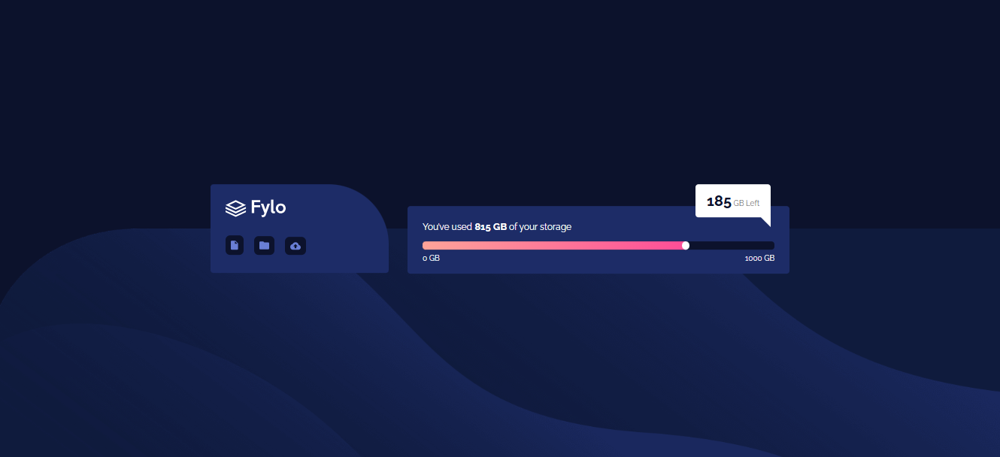

# Frontend Mentor - Fylo data storage component

This is a solution to the [Fylo data storage component](https://www.frontendmentor.io/challenges/fylo-data-storage-component-1dZPRbV5n). Frontend Mentor challenges help you improve your coding skills by building realistic projects.

## Table of contents

- [Overview](#overview)
  - [The challenge](#the-challenge)
  - [Screenshot](#screenshot)
  - [Links](#links)
- [My process](#my-process)
  - [Built with](#built-with)
  - [What I learned](#what-i-learned)
  - [Continued development](#continued-development)
- [Author](#author)
- [Acknowledgments](#Acknowledgments)

## Overview

### The challenge

This component has some interesting CSS challenges in the design. If you're looking to test your CSS skills, this will be a great project for you!

Your users should be able to:

- View the optimal layout for the site depending on their device's screen size

### Screenshot



### Links

- Solution URL: [here](https://github.com/olahasan/HTML_AND_CSS_Frontend-Mentor_JUNIOR-Fylo-data-storage-component)

- Live Site URL: [here](https://olahasan.github.io/HTML_AND_CSS_Frontend-Mentor_JUNIOR-Fylo-data-storage-component/)

## My process

### Built with

- Semantic HTML5 markup
- CSS custom properties
- Flexbox
- Mobile-first workflow

### What I Learned

In this project, I learned how to effectively use CSS custom properties for maintaining a consistent color scheme. I also practiced using Flexbox for creating a responsive layout and improved my understanding of responsive design with media queries.

```css
.big-box .container {
  display: flex;
  justify-content: center;
  position: absolute;
  top: 50%;
  left: 50%;
  transform: translate(-50%, -50%);
}
```

### Continued Development

In future projects, I plan to focus on improving accessibility by using more semantic HTML tags and adding ARIA labels where necessary. I also aim to further optimize my CSS by grouping similar styles together.

### Author

Frontend Mentor - @olahasan<br>
GitHub - @olahasan

### Acknowledgments

Thanks to **Frontend Mentor** for providing this challenge and to the community for their support and feedback
